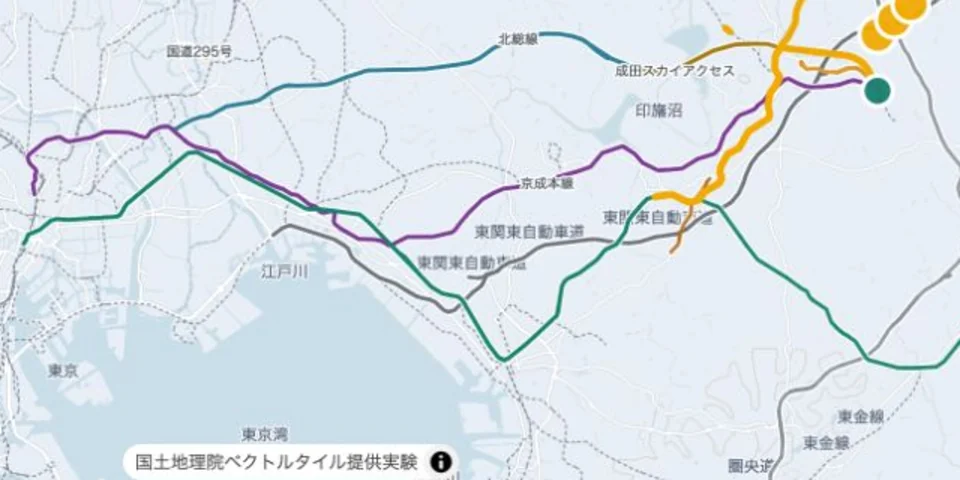

# Airport Access Map

**空港周辺の交通・気象情報を、一画面で確認するためのオープンソースWebアプリです。**

[デモを開く](https://allnew.work/demo/airport-access/) ・ [プロジェクトの背景と設計](docs/project-overview.md) ・ [Contributing](CONTRIBUTING.md)



Airport Access Mapは、国際便が就航する日本の空港を利用する旅行者が、鉄道・空港バス・道路・気象の情報を空港単位で確認するためのモバイルファーストUIです。日本語、英語、簡体字中国語、繁体字中国語、韓国語に対応しています。

公開リポジトリと公開デモに収録している交通・気象状態は、すべて架空のサンプルです。実際の運行・通行・警報情報ではありません。

## 何を確認できるか

- 33空港を名称または3レターコードで検索・切替
- 鉄道、空港バス、道路、気象を地図とサマリーで確認
- 「空港から移動」「空港へ移動」「空港に滞在」の目的別表示
- 通常時と交通障害時を想定した、架空の1週間分の履歴再生
- 空港内施設、自治体の防災・避難情報、旅行者向け支援への導線
- 5言語の固定UIとサンプル事象
- 390×844pxを基準にしたモバイル表示

## このリポジトリが公開する範囲

| 収録するもの | 収録しないもの |
| --- | --- |
| Webアプリのソースコード | 未許諾の交通事業者ページ本文 |
| 架空であることを明示したサンプルデータ | 実際の運行履歴・取得済みスナップショット |
| OpenStreetMap由来の静的な参考経路 | APIキー、収集キャッシュ、内部監査証跡 |
| 公式サイトへのリンク台帳 | 実運行・通行状態を断定するデータ |
| 検証スクリプトと回帰テスト | 制作途中の画像・動画・内部Factory設定 |

公開版のGitHub Actionsは架空サンプルだけをビルドします。実データの自動取得は実行しません。実運用へ移行する場合は、提供者ごとの明示ライセンスまたは書面許諾、データ品質管理、監視、運用責任者が別途必要です。

## 開発者の想い

私自身、公共交通機関の乱れに遭遇し、運行状況や代替手段を確認するために、鉄道、バス、道路、空港など複数のサイトを行き来しました。必要な情報を確認するだけで、多くの時間と労力がかかったことが、このプロジェクトの出発点です。

交通障害のたびに利用者が同じように情報を探し回れば、事業者の案内窓口や公式サーバーにも問い合わせが集中します。空港ごとに情報を整理し、多言語で届ける仕組みが業界の共通基盤として整えば、利用者は次の行動を早く判断でき、事業者側の案内対応とアクセス集中の負担も軽くできます。このOSSが、空港、交通事業者、自治体がそのような基盤を検討するための、実用的なたたき台になればと考えています。

## 設計の要点

災害時は、運行情報を求めるアクセスが短時間に集中します。このアプリまで、画面を開くたびに交通事業者のサーバーへ問い合わせる構成にすると、利用者が増えるほど事業者側へのリクエストも増え、公式情報の提供を妨げかねません。

そこで、旅行者が見る画面とデータ更新処理を分離しました。実運用で許諾済みデータを扱う場合は、更新処理が所定の間隔で取得・検証し、配信用の静的JSONを生成します。旅行者のブラウザは静的ホスティングだけを参照するため、閲覧トラフィックを交通事業者のAPIやWebサーバーへ直接転送しません。

### 閲覧集中を受け止める静的配信

Vite、Vanilla JavaScript、MapLibre GL JSで構成し、HTML、JavaScript、GeoJSONをGitHub Pagesなどから静的配信します。アクセスが増えても交通事業者への取得回数を閲覧数に連動させず、常時起動するバックエンドや従量課金APIを必要としない構成です。

### Andon Gate

更新処理に失敗したとき、その障害を利用者画面まで連鎖させないための安全弁です。候補データが空、形式不正、非公式ホスト、範囲外座標などの場合は公開ファイルを更新せず、壊れた候補で直前の正常ファイルを上書きしないことをテストします。

### Evidence Gate

情報を集約する便利さと、根拠のない状態表示を避けることを両立するための境界です。画面内へ状態を掲載するには、情報源、観測時刻、利用可能な権利根拠を確認できることを前提にしています。公開デモではこの境界を明確にするため、実状態ではなく架空サンプルだけを使用します。

### 多空港対応

空港固有情報は`src/airport-registry.js`、自治体支援情報は`src/national-airport-local-support.js`へ分離しています。空港直結鉄道がない空港を鉄道路線のように描かないことも回帰テストで確認します。

## 対象空港

- 北海道：旭川、帯広、新千歳、函館
- 東北：青森、いわて花巻、仙台
- 関東：成田、羽田、茨城
- 北陸・甲信越：新潟、富山、小松
- 東海：富士山静岡、中部
- 関西：関西
- 中国：岡山、広島、米子
- 四国：高松、徳島、松山
- 九州：北九州、福岡、佐賀、長崎、大分、熊本、宮崎、鹿児島
- 沖縄：那覇、下地島、石垣

## ローカル起動

Node.js 22.12以降が必要です。

```bash
npm ci
npm run sample:generate
VITE_SAMPLE_DEMO=true VITE_PUBLIC_BASE=/ npm run dev
```

公開クローンには実運行データを収録していないため、`npm run dev`だけではなく、必ず上記の架空サンプル設定で起動してください。

## 検証

公開可能なOSS範囲の検証は次のコマンドで実行します。

```bash
npm run verify:oss
```

このコマンドは、公式リンクのallowlist、参考経路、33空港分の架空サンプル、Node.js回帰テスト、GitHub Pages用production buildを検証します。

実ブラウザをリモートデバッグ付きで起動している場合は、390×844pxの表示も測定できます。

```bash
npm run verify:mobile -- \
  --port 9225 \
  --url http://127.0.0.1:5173/?airport=nrt
```

## ディレクトリ

```text
src/                    UI、空港台帳、多言語、履歴再生
scripts/                データ生成、検証、Andon Gate
scripts/config/         公式リンクの参照先
public/data/sample/     33空港分の架空サンプル
public/data/access-network.geojson
                        OpenStreetMap由来の参考経路
test/                   回帰テスト
docs/                   設計・UX・データ境界
```

## データと権利

- ソフトウェアは[MIT License](LICENSE)で公開します。
- OpenStreetMap由来の参考経路には[ODbL 1.0](https://opendatacommons.org/licenses/odbl/1-0/)が適用されます。
- 地図表示時は国土地理院の地理院タイルを使用します。利用時は[地理院タイル一覧](https://maps.gsi.go.jp/development/ichiran.html)と[国土地理院コンテンツ利用規約](https://www.gsi.go.jp/kikakuchousei/kikakuchousei40182.html)を確認してください。
- 空港、交通事業者、路線などの名称は識別のために使用しており、各組織との提携・認定を示すものではありません。

詳細は[THIRD_PARTY_NOTICES.md](THIRD_PARTY_NOTICES.md)を参照してください。

## セキュリティ

脆弱性を発見した場合は、公開Issueへ詳細を書かず、[SECURITY.md](SECURITY.md)の窓口へ連絡してください。

## ライセンス

Copyright © 2026 AllNew LLC

ソフトウェア部分はMIT Licenseです。第三者データや名称・ロゴへMIT Licenseが一律に適用されるものではありません。
